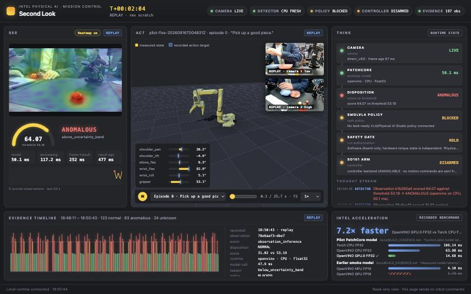
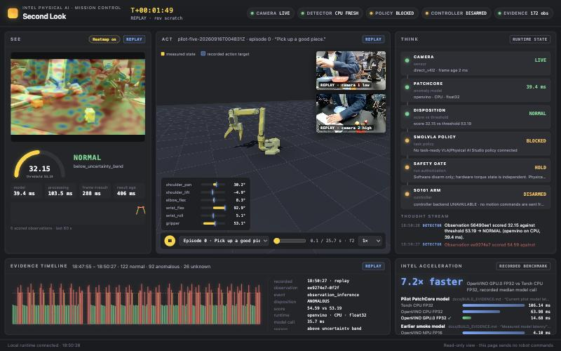
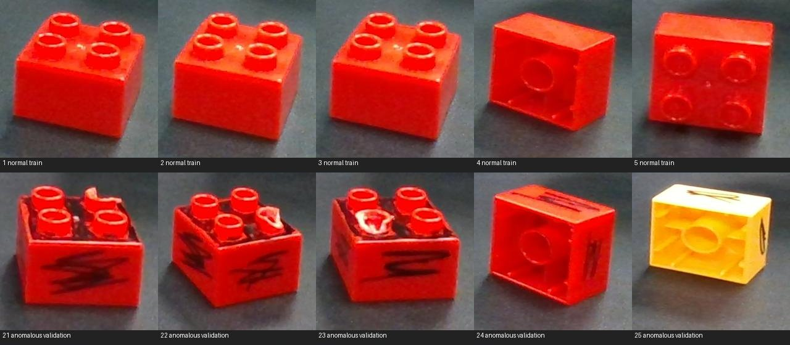
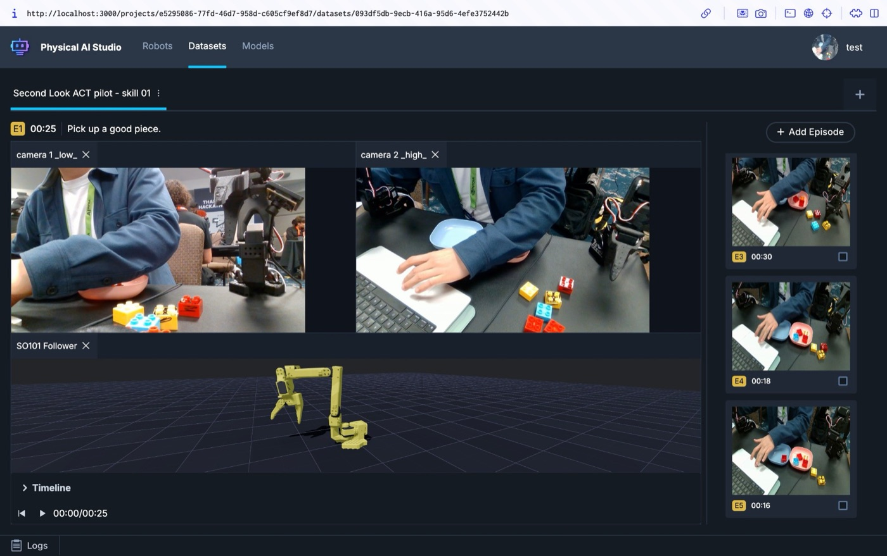
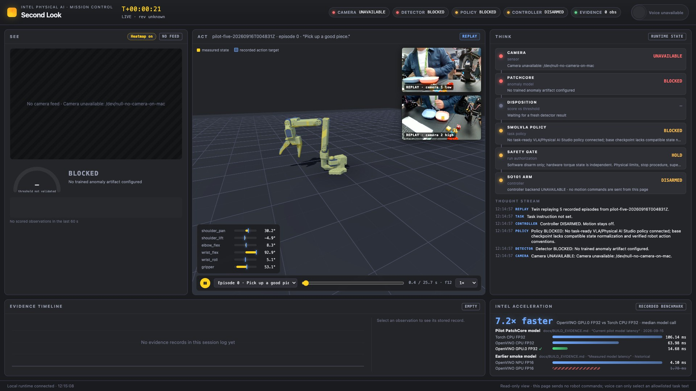

# Second Look

**An anomaly-aware sorting cell for the Intel Physical AI Challenge.** A camera watches a LEGO block in an inspection area, an Anomalib PatchCore model running on OpenVINO decides GOOD / BAD / UNKNOWN, and a Physical AI Studio VLA is meant to place the block in the matching bin with an SO-101 arm.

> **Status: paused (September 23, 2026).** The inspection half is real and runs on the Intel PC. The placement half is prepared but not trained, and the arm has never been moved by this app. Zero autonomous physical trials. See [where things stand](#where-things-stand) and [next steps](#next-steps).



<sub>**REAL** capture from the Intel PC during the build: live low-camera feed with the PatchCore heatmap (SEE), a replayed demonstration on the SO-101 digital twin (ACT, labelled REPLAY), and the decision pipeline (THINK). Score 64.07 is above the 53.19 threshold, so the verdict is ANOMALOUS. Policy stays BLOCKED and the controller DISARMED.</sub>

## How it works

```
Studio cameras ──► Second Look (attach-only subscriber)
                      │
                      ▼
          Anomalib PatchCore ── OpenVINO GPU.0 FP32 ──► GOOD │ BAD │ UNKNOWN
                      │
          UNKNOWN ────┴──► no policy call, safe pause / human review
          GOOD / BAD ────► fixed Studio instruction
                           GOOD: "…place it in the blue bin."   BAD: "…place it in the pink bin."
                      │
                      ▼
          Studio SmolVLA.select_action(cameras + follower state)      ◄── not trained yet
                      │
                      ▼
          NativePolicyGuard (freshness, bounds, sole writer) ──► SO-101  ◄── not deployed
```

Detector scores are distances, not probabilities, so the app uses an uncertainty band around the threshold and returns UNKNOWN inside it. UNKNOWN never places a block.

<table>
<tr>
<td width="50%"></td>
<td width="50%"></td>
</tr>
<tr>
<td><sub><b>REAL</b>, Intel PC: the same page with a NORMAL verdict (32.15 vs 53.19). The Intel acceleration card shows the recorded PatchCore benchmark.</sub></td>
<td><sub><b>REAL</b> captures: normal specimens (top) and anomalous specimens (bottom) used to fit and validate PatchCore.</sub></td>
</tr>
<tr>
<td></td>
<td></td>
</tr>
<tr>
<td><sub><b>RECORDED_REAL</b>: teleoperated demonstrations in Intel Physical AI Studio (two cameras plus the SO-101 follower).</sub></td>
<td><sub><b>REPLAY</b>, Mac: mission control playing a recorded episode with no camera or robot attached.</sub></td>
</tr>
</table>

## Where things stand

| Area | State | Evidence |
|---|---|---|
| Camera ingest | **REAL.** Attach-only subscriber to Studio's shared camera frames on the Intel PC. | [RUNBOOK](docs/RUNBOOK.md) |
| Defect detection | **REAL, limited.** PatchCore fitted on the H100, converted to OpenVINO, 28/28 Torch vs OpenVINO parity checks. Validation is 14 repeated views of three specimens from one session: one defect missed, four UNKNOWN. No unseen-specimen test. | [BUILD_EVIDENCE](docs/BUILD_EVIDENCE.md), [CV_STATUS](docs/CV_STATUS.md) |
| Intel acceleration | **REAL** for the detector: median model call 14.68 ms on OpenVINO GPU.0 FP32 vs 106.14 ms Torch CPU (7.2×). NPU is not measured for the deployed model. | [BUILD_EVIDENCE](docs/BUILD_EVIDENCE.md) |
| Placement data | **RECORDED_REAL.** 27 inspection-to-bin demonstrations (15 BLUE, 12 PINK), frozen 17/5/5 split, manifest and H100 transfer bundle prepared. | [PLACEMENT_SMOLVLA_STATUS](docs/PLACEMENT_SMOLVLA_STATUS.md) |
| VLA policy | **Not trained.** SmolVLA trainer, export, and Intel verifier exist; no placement fine-tune has run. An earlier one-step probe on other data failed native reload and is not deployable. | [H100_TRAINING_GUIDE](docs/H100_TRAINING_GUIDE.md), [H100_READINESS](docs/H100_READINESS.md) |
| Robot execution | **Not tested.** Safety gate and policy guard are mock-verified only. Second Look sends no robot commands. | [NATIVE_POLICY_GUARD](docs/NATIVE_POLICY_GUARD.md), [POLICY](docs/POLICY.md) |

Evidence labels used everywhere in this repo: `REAL`, `RECORDED_REAL`, `REPLAY`, `SYNTHETIC`, `MOCK`. Please keep them.

## Next steps

These come from the rubric-gap analysis in [DEMO_READY_TASKS.md](docs/DEMO_READY_TASKS.md), which has the full task breakdown (T3–T9). Do them in order, since each one gates the next.

1. **Restore access.** SSH to the Intel PC (`intel-robot`) timed out on September 23, and H100 job state is unknown. Recheck both before anything else, and inspect the shared GPU lock instead of assuming no job is running.
2. **Fine-tune placement SmolVLA on the H100.** Use the prepared 27-episode dataset with `training_scope=step_three_placement`, following [placement-training.md](scripts/h100/placement-training.md). Run a smoke fit first, then the full fit, then per-route offline evaluation on the held-out episodes.
3. **Verify the policy on Intel.** Export it and run `scripts/h100/verify_smolvla_intel.py` against a real observation, with a same-device reload comparison. This fixes the failure mode of the earlier probe.
4. **Close the loop in the app.** Feed the detector verdict into the Studio policy through `StudioPolicyBridge` and the native guard, so one process owns robot commands. This is the 25-point end-to-end category and is currently worth zero.
5. **Harden detection.** Get authoritative defect criteria, collect unseen specimens, and run a held-out test. Confirm that exactly one block sits in the region of interest.
6. **Measure the deployed workloads.** Measure the NPU and GPU for the detector and, if parity holds, for the exported policy.
7. **Run bounded supervised trials.** Get one written authorization that states the workspace, limits, and stop procedure. Then record every trial as `REAL` with its outcome.

## Run it

Everything is managed by [uv](https://docs.astral.sh/uv/).

```bash
uv sync --group cv
```

Replay mission control on a Mac. This needs no camera or robot. First pull the data (see below).

```bash
uv run --group cv scripts/run_app.py --camera /dev/null-no-camera-on-mac --port 8091 --replay-dataset artifacts/recording/pilot-five-20260916T004831Z/dataset
```

Then open <http://127.0.0.1:8091/mission>.

Run the portable test suite:

```bash
uv run pytest
```

Live deployment on the Intel PC, the camera path, voice, and packaging are in [docs/RUNBOOK.md](docs/RUNBOOK.md). Remote host facts are in [docs/REMOTE_ENVIRONMENT.md](docs/REMOTE_ENVIRONMENT.md).

## Data and backups

- **Public dataset:** [huggingface.co/datasets/ohong/intel-robotics-dataset](https://huggingface.co/datasets/ohong/intel-robotics-dataset) mirrors the ignored `artifacts/` tree: recordings, LEGO captures, PatchCore models, annotations, placement receipts, and verification evidence. Restore it with this command:

  ```bash
  hf download ohong/intel-robotics-dataset --repo-type dataset --local-dir .
  ```

- **Private archive:** `ohong/intel-robotics-archive` (private HF dataset) holds a full-history git bundle with every branch and tag, the Git LFS objects (including the pilot deliverable tarballs), and `pc-context/`. Its README has the restore commands.
- **Off-repo data:** the frozen 27-episode placement source and its prepared derivative live on the Intel PC under `/home/ird-demo/second-look/placement-v1/`. They are not copied anywhere else yet. See [AGENT_STATE.md](AGENT_STATE.md).

## Repo map

| Path | Contents |
|---|---|
| `secondlook/` | App: camera ingest, anomaly detector, runtime state, safety gate, policy bridge, replay, voice, and web UI (`/` operator, `/mission` mission control). |
| `scripts/` | App launcher, remote deploy (`remote.py`), capture tools, Studio workers, and packaging. |
| `scripts/h100/` | H100 trainers (Anomalib, ACT, SmolVLA), placement preparation and contract, export, Intel verifiers, and transport. |
| `scripts/recording/` | Studio recording helpers. These run only on the Intel PC. |
| `tests/` | Portable test suite. |
| `docs/` | Runbook, build evidence, dataset and CV status, training guides, and the demo-ready task plan. |
| `config/`, `patches/`, `runtime/` | Voice commands, the Studio UI patch, and runtime templates. |
| `PROJECT_SPEC.md`, `AGENTS.md`, `prompts/KICKOFF.md` | Challenge requirements, agent operating rules, and the active kickoff prompt. |
| `AGENT_STATE.md` | Handoff state for the next agent. **Start here when you resume.** |
